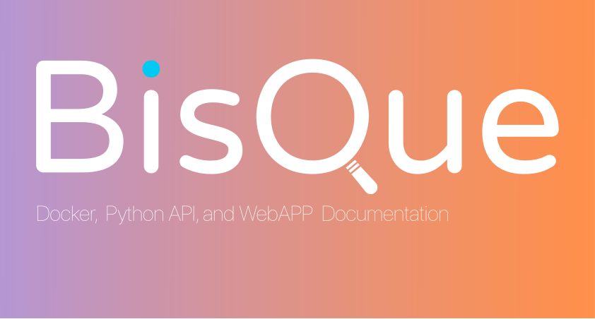
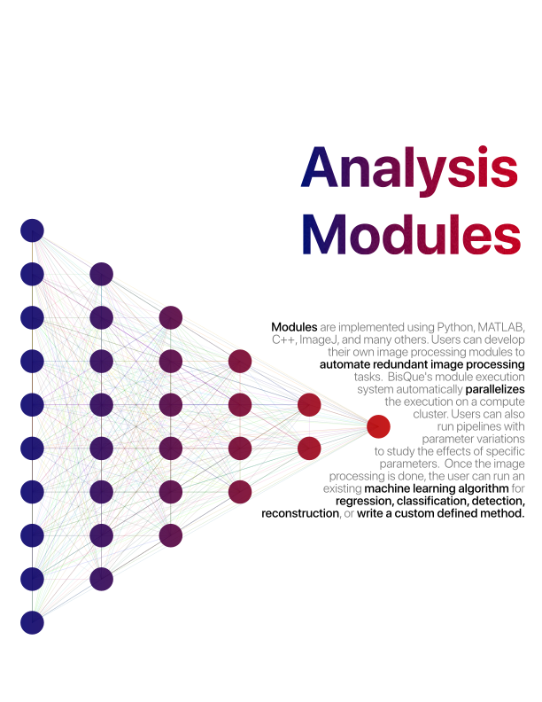

--- 
site: bookdown::bookdown_site
documentclass: bookdown
bibliography: [book.bib, packages.bib]
biblio-style: apalike
link-citations: yes
description: "Bisque (Bio-Image Semantic Query User Environment) : Store, visualize, organize and analyze images in the cloud."
output:
  bookdown::gitbook:
    highlight: pygments
---
--- 
site: bookdown::bookdown_site
documentclass: bookdown
bibliography: [book.bib, packages.bib]
biblio-style: apalike
link-citations: yes
description: "Bisque (Bio-Image Semantic Query User Environment) : Store, visualize, organize and analyze images in the cloud."
output:
  bookdown::gitbook:
    highlight: pygments
---


# Getting Started {-}






__Our modules currently span research areas that include Material Science, Biological Science, Biomedical Imaging, and Marine Science.__


__Users can develop and deploy custom state of the art modules by simply containerizing their module with Docker.__ 

## BisQue Docker Installation  {-}

> If you would like to have your own version of BisQue with minimal effort, use the Docker version of BisQue. The source code installation can be found [here](#source-code-installation).

1. Ensure you have the latest stable locally

    ```
      docker pull cbiucsb/bisque05:stable
    ```

2. Run a bisque server on the host port 8080:

    ```
      docker run --name bisque --rm -p 8080:8080 cbiucsb/bisque05:stable
    ```
  and point your browser at `http://<hostname>:8080`


3. Using host mounted modules to make it easier to edit.

   1. Copy the module directory  out of the container

      ```
         docker cp bisque:/source/modules container-modules
      ```

   2. restart the container with host mounted module

      ```
      docker stop bisque
      docker run --name bisque --rm -p 8080:8080 -v $(pwd)/container-modules:/source/modules  cbiucsb/bisque05:stable
      ```

4. Registering a module to your local server
   *  Login to your bisque server using admin:admin
   * Find the module manager under Admin button
   * put `http://localhost:8080/engine_service` in the right panel and hit load
     *  use localhost:8080 here because it's internal to the container.
   * Drag and Drop "MetaData" to the left panel


5.  Use an external data directory so you don't lose data when service stops
    - Uploaded image and workdirs are store in /source/data.  You can change this to be a host mounted directory with

    ```
     docker run --name bisque --rm -p 8080:8080 -v $(pwd)/container-data:/source/data  cbiucsb/bisque05:stable
    ```

    - The default sqlite database is stored inside the container at /source/data/bisque.db
    - The uploaded images are stored inside the container at /source/data/imagedir


<!--chapter:end:index.Rmd-->


# BisQue Cloud Instance {#intro} 

Placeholder


## How to Login or Create a New User 
## How to Upload Data 
### Step 1. Login {-}
### Step 2. Upload File or Folder {-}
### Step 3. Build a Dataset {-}
#### Add to New Dataset {-}
#### Add to Existing Dataset {-}
### Step 4. Setting Permissions {-}
## How to Run a Module 
## ImageJ Module 
### Overview {-}
### Uploading of ImageJ Pipelines {-}
### Running an ImageJ Macro {-}
### Special BisQue extensions for ImageJ {-}
## CellProfiler Module 
### Overview {-}
### Uploading of CellProfiler Pipelines {-}
### Running a CellProfiler Pipeline {-}
### Results {-}

<!--chapter:end:01-intro.Rmd-->


# Module Development

Placeholder


## Dockerfile 
## Module XML
### Module Description {-}
### Configurations for Images, Datasets, and Resources {-}
#### `Image` Specific Configurations {-}
#### `gobject` Specific Configurations {-}
### Data-Parallel Execution {-}
## Python Script Wrapper
### _Example._  Python Script Wrapper {-}
#### Imports {-}
#### Python Script Wrapper Class {-}
#### Main Function {-}
## Source Code
### _Example._ Composite Strength Module {-}
## Runtime Module Configuration
## Python Setup

<!--chapter:end:02-literature.Rmd-->


# BQAPI

Placeholder


<!--chapter:end:03-method.Rmd-->


# BisQue Development

Placeholder


## Source Code Installation
### Clone the repository and Prepare Virtual Environment {-}
### Configure Bisque Environment {-}
### Run Bisque Server {-}
### Upload Dataset {-}
### Module {-}
### Debug Module {-}
### G. Module MEX/UI {-}
#### Further {-}
#### Docker & Condor based modules require additional setup {-}
## Planteome Deep Segment 
#### [Reference](https://github.com/pndaly/BisQue_Platform_Guide) 
#### Pre-requisite: [link](./bisque.md)
#### Add/Deploy the [Planteome module](https://github.com/Planteome/planteome-deep-segmenter-dockerized)
#### Build/Configure the module 
#### Steps to run the algorithm from Bisque Client
#### Isolated/Development test setup
##### Setup/Run the docker container for test
## Rancher 2.0 Setup (w/Kubernetes engine)
### Pre-requisite
##### General instructions
##### Note: Assuming we have bq-cluster with postgres and persistent volumes
### Setup Workload on the bq-cluster
##### Bisque Service Workload configuration
##### Environment Configuration
##### Condor provisioning 
##### Workload (bq-cluster) Dashboard
## Connoisseur/GPU Workload provisioning
##### Pre-requisites
#### A.) Bisque Client Service Workload configuration
##### Environment Configuration
####  B.) Bisque Engine Service Workload configuration
##### Workload (bq-cluster) with Namespace Connoissuer

<!--chapter:end:04-application.Rmd-->


# Getting Started {-}

Placeholder


## BisQue Docker Installation  {-}
## How to Login or Create a New User 
## How to Upload Data 
### Step 1. Login {-}
### Step 2. Upload File or Folder {-}
### Step 3. Build a Dataset {-}
#### Add to New Dataset {-}
#### Add to Existing Dataset {-}
### Step 4. Setting Permissions {-}
## How to Run a Module 
## ImageJ Module 
### Overview {-}
### Uploading of ImageJ Pipelines {-}
### Running an ImageJ Macro {-}
### Special BisQue extensions for ImageJ {-}
## CellProfiler Module 
### Overview {-}
### Uploading of CellProfiler Pipelines {-}
### Running a CellProfiler Pipeline {-}
### Results {-}
## Dockerfile 
## Module XML
### Module Description {-}
### Configurations for Images, Datasets, and Resources {-}
#### `Image` Specific Configurations {-}
#### `gobject` Specific Configurations {-}
### Data-Parallel Execution {-}
## Python Script Wrapper
### _Example._  Python Script Wrapper {-}
#### Imports {-}
#### Python Script Wrapper Class {-}
#### Main Function {-}
## Source Code
### _Example._ Composite Strength Module {-}
## Runtime Module Configuration
## Python Setup
## Source Code Installation
### Clone the repository and Prepare Virtual Environment {-}
### Configure Bisque Environment {-}
### Run Bisque Server {-}
### Upload Dataset {-}
### Module {-}
### Debug Module {-}
### G. Module MEX/UI {-}
#### Further {-}
#### Docker & Condor based modules require additional setup {-}
## Planteome Deep Segment 
#### [Reference](https://github.com/pndaly/BisQue_Platform_Guide) 
#### Pre-requisite: [link](./bisque.md)
#### Add/Deploy the [Planteome module](https://github.com/Planteome/planteome-deep-segmenter-dockerized)
#### Build/Configure the module 
#### Steps to run the algorithm from Bisque Client
#### Isolated/Development test setup
##### Setup/Run the docker container for test
## Rancher 2.0 Setup (w/Kubernetes engine)
### Pre-requisite
##### General instructions
##### Note: Assuming we have bq-cluster with postgres and persistent volumes
### Setup Workload on the bq-cluster
##### Bisque Service Workload configuration
##### Environment Configuration
##### Condor provisioning 
##### Workload (bq-cluster) Dashboard
## Connoisseur/GPU Workload provisioning
##### Pre-requisites
#### A.) Bisque Client Service Workload configuration
##### Environment Configuration
####  B.) Bisque Engine Service Workload configuration
##### Workload (bq-cluster) with Namespace Connoissuer

<!--chapter:end:BisQue_Documentation.Rmd-->

